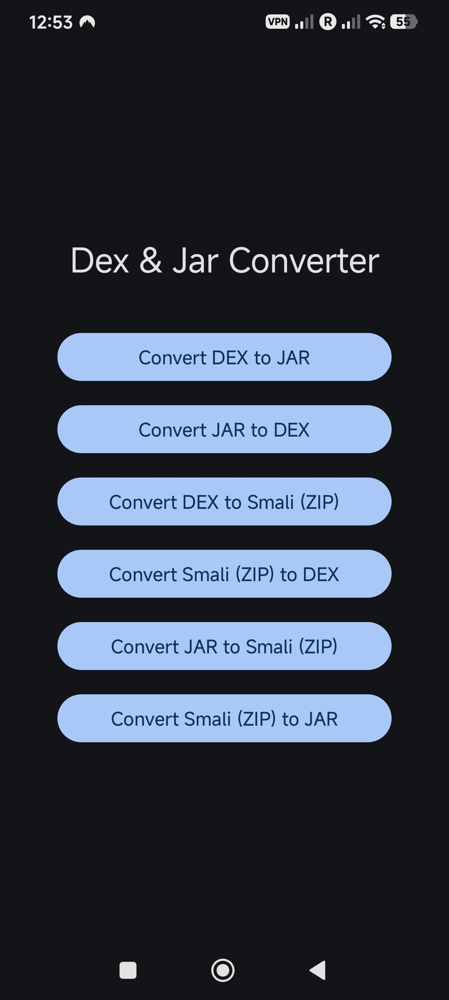

# Dex & Jar Converter

A native Android app to convert between DEX, JAR, and Smali formats — all on-device, no PC required.

  

---

## Features

| Conversion | Description |
|---|---|
| DEX → JAR | Translates Dalvik bytecode back into standard Java `.class` files |
| JAR → DEX | Compiles JAR to Android DEX using Google's D8 compiler (Java 8+ supported) |
| DEX → Smali (ZIP) | Disassembles a DEX file into Smali source, output as a ZIP |
| Smali (ZIP) → DEX | Assembles a zipped Smali folder back into a runnable DEX |
| JAR → Smali (ZIP) | Chained: JAR → DEX → Smali in one step |
| Smali (ZIP) → JAR | Chained: Smali → DEX → JAR in one step |

## Why not MT Manager?

MT Manager handles APK editing but does **not** support:
- Direct JAR ↔ DEX conversion
- Smali ↔ JAR chained conversion
- Running D8 compiler on-device

This app fills that gap with a focused, minimal interface.

## Download

Grab the APK from [Releases](../../releases).

## Tools Used

- [dex2jar](https://github.com/pxb1988/dex2jar) — DEX to JAR
- [Google D8](https://developer.android.com/tools/d8) — JAR to DEX
- [smali/baksmali](https://github.com/JesusFreke/smali) — DEX ↔ Smali

## Requirements

- Android 8.0+
- No root required
